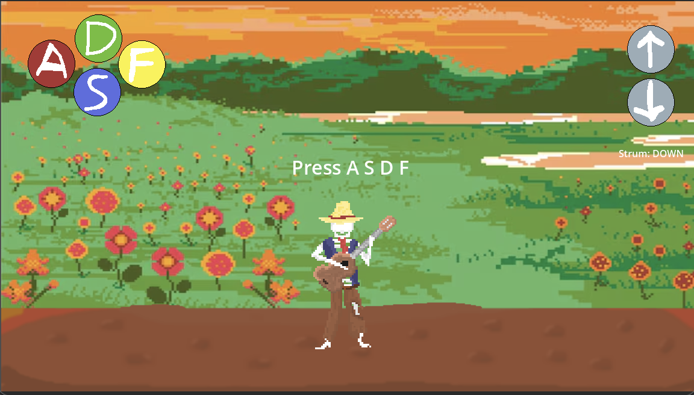

# 2d CR


Name: Roman Bochuliak

Student Number: A00041960

Class Group: TU850


# Video

[[YouTube](https://youtu.be/JEpfwYZcqXI)

# Screenshots

Gameplay 




# Description of the project

Simple 2d music game where users can play recorded guitar sounds on their keyboards

# Instructions for use

There are 6 buttons to press on the keyboard:

A - Plays recorded guitar sounds of the Am chord

S - Plays recorded guitar sounds of the G chord

D - Plays recorded guitar sounds of the C chord

D - Plays recorded guitar sounds of the F chord

Up and Down Arrows - change the strumming pattern

Or you can use a touchpad or a mouse


# How it works:
So, basically,  when the user presses some buttons, the sounds are being played and then some animations too.


# References
* My in-game character was based on a character from the movie "Coco"


# What I am most proud of in the assignment
I am proud that I was able to combine my favourite music instrument and my skills to make a simple sound game based on recorded sound.

And also that I draw some cool textures and animations.

# What I learned
First of all, my general understanding of Godot improved significantly. Now I can make a recorded sound be played with code
Also, I learned how to draw simple 2d pixelarts and animations.


## Below is how to use Markdown. You can delete this:

## This is how to markdown text:

This is *emphasis*

This is a bulleted list

- Item
- Item

This is a numbered list

1. Item
1. Item

This is a [hyperlink](http://bryanduggan.org)

# Headings
## Headings
#### Headings
##### Headings

This is code:

```Java
public void render()
{
	ui.noFill();
	ui.stroke(255);
	ui.rect(x, y, width, height);
	ui.textAlign(PApplet.CENTER, PApplet.CENTER);
	ui.text(text, x + width * 0.5f, y + height * 0.5f);
}
```

So is this without specifying the language:

```
public void render()
{
	ui.noFill();
	ui.stroke(255);
	ui.rect(x, y, width, height);
	ui.textAlign(PApplet.CENTER, PApplet.CENTER);
	ui.text(text, x + width * 0.5f, y + height * 0.5f);
}
```


This is a table:

| Heading 1 | Heading 2 |
|-----------|-----------|
|Some stuff | Some more stuff in this column |
|Some stuff | Some more stuff in this column |
|Some stuff | Some more stuff in this column |
|Some stuff | Some more stuff in this column |

